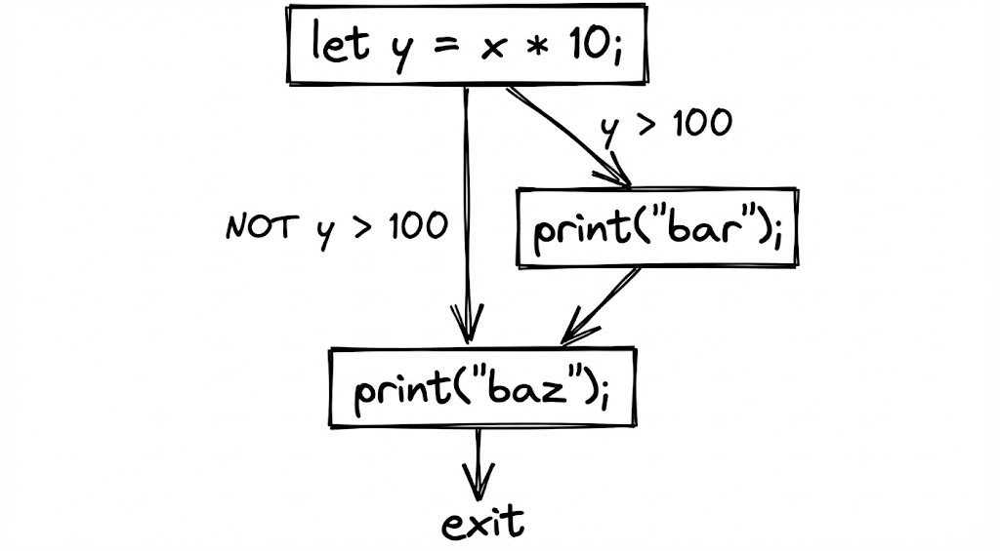
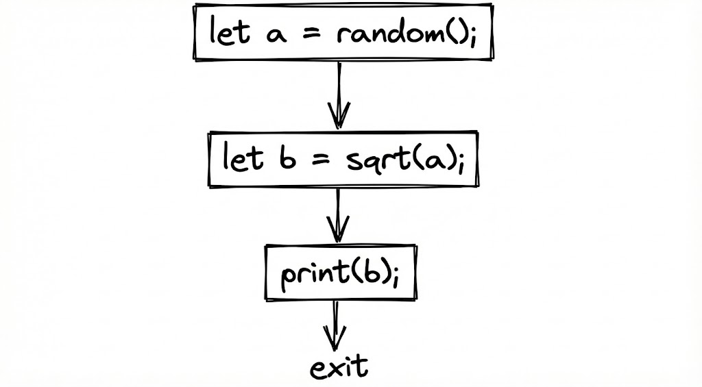
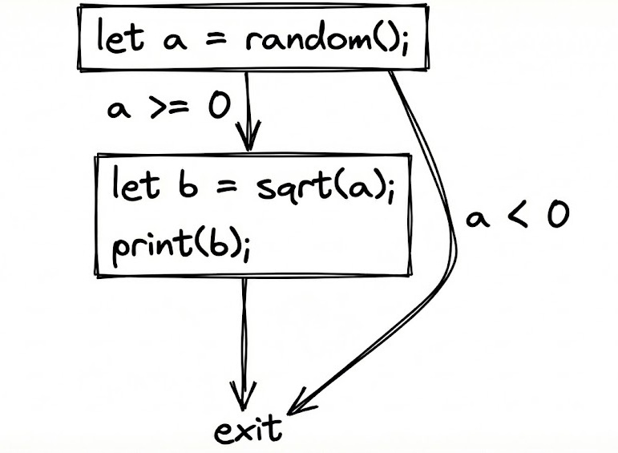
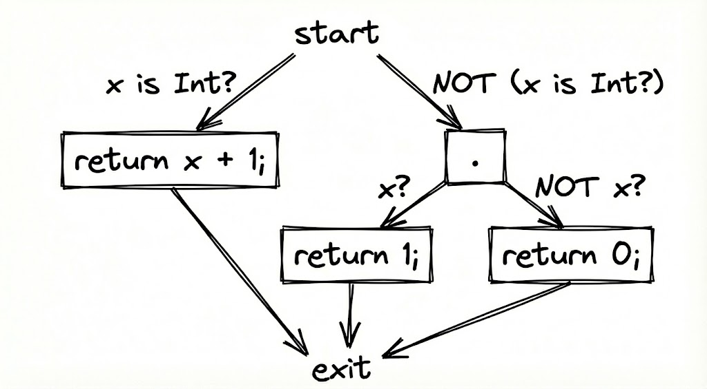
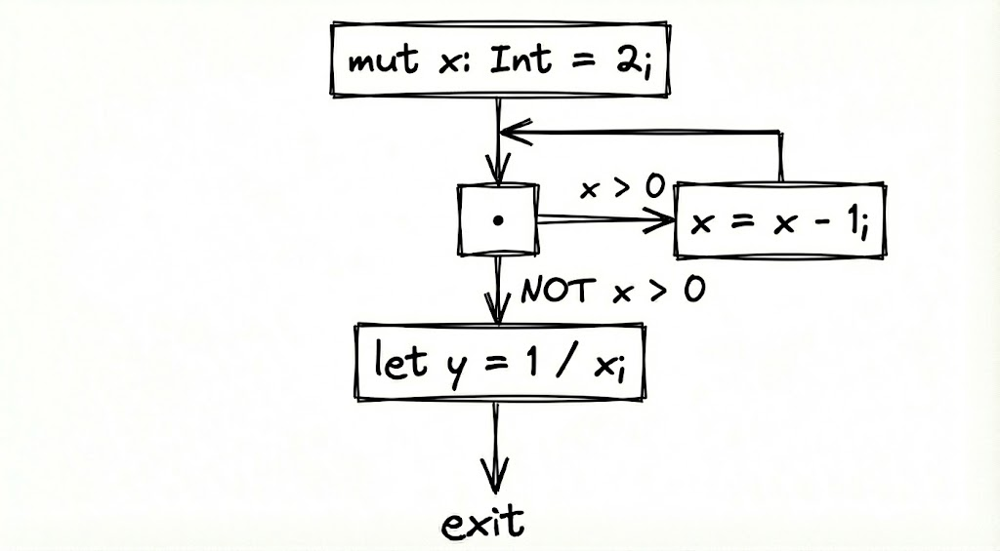

Back in September, I finally graduated university. After four years of the most mind-numbing, *boring* lectures I've experienced (except for my algorithms class), I'm free.

But before I could be granted that freedom, I needed to work on a graduation project. For a software engineering degree (which is what I have), it was mandatory for students to form groups of 2-3 to work on some kind of application or system. You'd be responsible for gathering requirements to create the Software Requirement Specification, then the Software Design Specification (which involves a dozen diagrams), then the Software Testing Specification, and finally the actual implementation of your project.

It was a big enough workload that graduation projects were often worked on over the course of *two* semesters. And in my case, I was the only one crazy enough from the graduating class to do it solo rather than form a group.

Not that I didn't want to work with others. I wanted to challenge myself and produce something *useful*, or at least have a tiny bit of research value. 95% of the graduation projects were just yet another social media clone, yet another mobile app for renting XYZ service, and so on. I didn't really find anyone else with the skillset or drive I was looking for.

Wanting to set myself apart from the crowd, I thought to myself: 'what if I make a programming language?'. I'm thankful my supervisor actually *allowed* me to work on my own, let alone on something that's so unlike most other graduation projects the faculty sees.

Alright. That's enough context. This post is about Verifex, which is the culmination of that effort. The language itself had a design since the start, but I implemented it over the course of about **two weeks** leading up to the submission deadline, even as I was swamped with other workloads.

It was a very insightful two weeks, thankfully, even if it was stressful. 

In this post I'll talk about the language itself, a little bit about its frontend, and mostly on its backend - the most cool part about Verifex (to me at least) is that it's powered by an **SMT Solver** under the hood. If you don't know what that is, don't worry - I didn't either. I'll explain when we get to it.

Here's exactly what we're going to go through, in order:
- A quick tour of the language itself (it's tiny)
- A little bit of the frontend (you can skip this if you want)
- How the language is powered by **SMT solvers**
- How you can model programs as a set of nothing but constraints
- And then use that to prove a program is *correct*
- The part where I realized I accidentally implemented SSA without phi nodes
- Using the power of set theory to run from the halting problem
- Banging my head against the wall for targeting .NET as the backend

If none of these points sound familiar, read anyways! I explain everything. That said, if you *are* familiar (and if you are, you might be one of the scary pedants), please go easy. I tried to keep this writeup as accessible as possible.

Oh, and there's a [web playground](https://trivaxy.github.io/VerifexPad).

Hope you enjoy!

## The Language

At its core, Verifex is actually pretty simple, for a programming language. It's statically typed, has a Rust-like syntax (yes, I'm one of those), and its entire focus was to provide a way to write programs where you can easily express as many contracts or invariants as you want, while being assured that the compiler would catch any violations.

Hell, 'Verifex' was just a shorthand for 'Verify + Execute'. That's the core idea. You want to specify what 'correct' means for your program, and the compiler then works with those assumptions.

If you're really into type theory, or worked with languages that have really expressive type systems, Verifex is sort of a ~~diet~~ lite version of those, for several reasons:
- I literally only had two weeks to implement it
- I never really read books or papers about type theory or how to implement 'serious' compilers, I just winged it
- I intentionally kept Verifex's design simple, because one of my goals was to bring over some of the nice type system stuff from those aforementioned languages, while keeping the mental model intuitive to most people

I won't delve into every single nook and cranny of the language (frankly there's very little), which thankfully means we get to focus on The Interesting Stuff™. I'll also talk about how the compiler works under the hood and my experience with it.

### Basics

The basics are pretty much all straightforward.
```rust
let name: String = "Trivaxy";
let age = 28;
mut counter = 0;

fn add(a: Int, b: Int) -> Int {
    return a + b;
}

fn greet(name: String) {
    print("Hello, " + name + "!");
}

fn main() {
    greet("World");
}
```

`let` declares immutable variables, `mut` declares mutable ones, and function syntax is pretty much the same as Rust's. We also have an entrypoint, `main`, which is where execution begins.

The language only has a few primitive types, which are `Int`, `Real`, `Bool`, and `String` (we'll talk about why `String` is considered primitive, don't worry).

You've also got `if/else` statements, and `while` loops.

Knowing that, let's try a simple task. We want to implement a utility function that receives an array of numbers, and returns the average.
```rust
fn average(values: Real[]) -> Real {
    mut sum = 0.0;
    mut i = 0;
    while (i < #values) {
        sum = sum + values[i];
        i = i + 1;
    }
    return sum / #values;
}
```

`#` is the length operator. It simply evaluates to the length of the array (or string) on its right-hand side. It's ripped straight from Lua, though there's a technical reason for it to exist which we'll, again, get to.

In most other languages, the analogue of this function would be just as simple (probably simpler, since I didn't implement `for` loops or niceties like `+=` yet).

Even *worse*, in most other languages, it'd actually run. Verifex's compiler, on the other hand, tosses an error at your face:
```
error: might divide by zero
8 |     return sum / #values;
  |                   ~~~~~~
```

Ah. The compiler noticed that `#values` might be zero. In other words, it's refusing to let the code compile because `values` might be an empty array. Other languages would've let such code run and crash or throw an exception happily. Verifex however is incredibly pedantic by design.

So, how can we fix this?

### Design By Contract <3 

Well, just handle the ugly case. Duh.
```rust
fn average(values: Real[]) -> Real {
    if (#values == 0) { return 0.0; } // <-

    mut sum = 0.0;
    mut i = 0;
    while (i < #values) {
        sum = sum + values[i];
        i = i + 1;
    }
    return sum / #values;
}
```

Now the compiler lets it slide. It knows that after the `if` guard, `#values` cannot be zero, so the division is safe.

But we've introduced another issue that's arguably just as bad, if not *worse*, than potential division by zero: implicit, assumed behavior. If this function is part of a library, or a codebase where many developers might call it, every single one of them must internalize that `average` will return `0.0` if the passed array is empty. But:
- Humans are prone to forgetting and mistakes, no matter what anyone believes
- This *expands* the error surface, because calling code must either ensure the passed array is non-empty or check if the result is 0
- `0.0` is also not a fundamentally well-defined result for taking the average of... nothing. An average over an empty array is mathematically undefined
- If this is a really hot function, that `if` guard might piss off your CPU's branch predictor

In software engineering, this violates something known as **Design by Contract**, or DbC for short. DbC operates on three rules:
1. The *caller* needs to enforce *preconditions*, which must be true before calling a function
2. The *callee* needs to enforce *postconditions*, which must be true when the function returns
3. *Invariants* are facts that must always be true when observed, for example, a certain object's field can never be negative

DbC isn't a new concept. It's a practice that's been around for decades. But enforcement of DbC is often left to the programmer to do manually, and it often happens at runtime, which isn't free. Different languages have different ways of enforcing it. If this was Java, tradition tells you to throw an `IllegalArgumentException` if the array is empty. Which hurts performance, *still* expands the error surface, and because it's a `RuntimeException`, you can't even catch it at compile time. Even if you make a new exception type and place it in the method's signature, the only net effect is you're now spamming `try-catch`.

Verifex takes a different approach via something called Refined Types. The concept behind them, as I learned later, was called Dependent Types - but the name stuck.

Refined Types are essentially a way to encode conditions about data at the type level, or in other words, make the type *depend* on the data values.

Let's go back to our function. The original issue that the compiler warned us about is that we might divide by zero due to an empty array. In other words, `average` *only* makes sense if the array is non-empty. So let's just accept any non-empty array:
```rust
type NonEmptyRealArray = Real[] where #value > 0;

fn average(values: NonEmptyRealArray) -> Real {
    mut sum = 0.0;
    mut i = 0;
    while (i < #values) {
        sum = sum + values[i];
        i = i + 1;
    }
    return sum / #values;
}
```

In Verifex, `NonEmptyRealArray` is a **refined type**. A refined type is a type with a condition attached to it that guarantees any piece of data the type represents will satisfy that condition. Within its predicate, `value` is a special placeholder that represents all possible types you are refining over (in this case, `value` would be `Real[]`).

Thus, `NonEmptyRealArray` is a type that represents any array of real numbers that is not empty.

Notice that we took out the `if` guard too. And the code compiles! On the surface, it looks like all we did was change the type of the parameter `values` from `Real[]` to `NonEmptyRealArray`. But this change is important: you've now instructed the compiler to guarantee that any array passed to `average` must be non-empty.

In other words, we've introduced the first mechanism of DbC, a **precondition**: `values` must be non-empty, and the *caller* must ensure that this is true.

Let's try to call `average`.
```rust
fn main() {
    let vals = [1.0, 2.0, 3.0];
    let empty: Real[] = [];
    average(vals);
    average(empty);
}
```

```
error: parameter 'values' has type 'NonEmptyRealArray', but got 'Real[]'
17 |     average(empty);
   |             ~~~~~
```

The compiler is now complaining that `empty`, which is `Real[]`, is not a `NonEmptyRealArray`. Specifically, `#empty <= 0`, which violates the refined type's condition. `vals` on the other hand, is a `Real[]` that satisfies `#vals > 0`, so it's also a `NonEmptyRealArray`.

This looks like an obvious, 'whatever' example, but consider an example like this. You want to read numbers from the user and calculate their average.
```rust
fn main() {
    let vals: Real[] = some_user_input();
    print(average(vals));
}
```

If `some_user_input` returns a `Real[]`, the compiler will not be able to guarantee that `vals` is non-empty, and it'll still complain. Effectively, what Verifex *wants* you to do is enforce preconditions yourself.
```rust
fn main() {
    let vals: Real[] = some_user_input();
    if (#vals == 0) {
        print("Sorry, nothing to calc here!");
        return;
    }
    print(average(vals)); // A-OK now
}
```

Verifex forces you to confront the fact your code may not be correct under your own written assumptions. Forcing preconditions to be met like this yields us a lot of benefits, mainly that:
1. Your program is more robust, since you are now always handling cases where values don't fit your assumptions
2. The happy path becomes really obvious. Helps maintenance and debugging a ton
3. No implicit assumptions like I complained about initially
4. For performance-sensitive contexts, it's better to assume incoming parameters are correct, instead of wasting cycles doing so when your caller could've done it for you
5. Probably others I'm not thinking of right now

Postconditions are also quite easy and useful. Take a simple function like this:
```rust
type NonNegativeReal = Real where value >= 0.0;

fn abs(x: Real) -> NonNegativeReal {
    return x;
}
```

The function is syntactically fine but logically *wrong*. The compiler throws an error:
```
error: function 'abs' has return type 'NonNegativeReal', but got 'Real'
2 |     return x;
  |     ~~~~~~~~
```

We're not guaranteeing the postcondition that the returned value can't be negative. However, this works:
```rust
type NonNegativeReal = Real where value >= 0.0;

fn abs(x: Real) -> NonNegativeReal {
    if (x < 0.0) { return -x; }
    return x;
}
```

Now, any caller calling `abs` will receive a value guaranteed to be a `NonNegativeReal`, which can be useful if the value needs to be used in contexts that also require that property (such as square roots).

### Maybe Types (well, union types)

Those are probably the most straightforward. In Verifex, you can combine different types together *into* a maybe-type, or *union* types as the more CS-oriented would call it.

```rust
fn get_user(id: Int) -> User or NotFound {
    let db = ...; // just pretend we have a database object
    if (id < #db.users) {
        return db.users[id];
    }
    else {
        return NotFound { error: "No user" };
    }
}
```

`get_user` returns a maybe type that can be *either* a `User` or a `NotFound` to the caller. You need to guarantee that the variant you access must actually be the one inside the maybe type via the `is` operator:

```rust
fn main() {
    let result = get_user(42);
    print(result.name);
}
```

```
error: cannot access member 'name' on an ambiguous type 'NotFound or User'
15 |     print(result.name);
   |           ~~~~~~~~~~~
```

Right. We're not sure if `name` is an instance of `User` or `NotFound`. We need to perform *narrowing* with the `is` operator:

```rust
fn main() {
    let result = get_user(42);

    if (result is User) {
        print(result.name);
    } else {
        print(result.error);
    }
}
```

The code now compiles. Within the `if` branch, the compiler knows `result` must be a `User`, and so within that branch its type narrows down to `User`. In the `else` branch, it narrows down to the only other possible alternative, which is `NotFound`.

This usecase is pretty much analogous to Rust's `Result<T, E>` type. Maybe types are a bit more general, because they can have more than two variants, and can compose refined types together as well.

Consider the following:
```rust
type Port = Int where value > 0 && value < 65536;
type WellKnownPort  = Int where value > 0     && value < 1024;
type RegisteredPort = Int where value >= 1024 && value < 49152;
type DynamicPort    = Int where value >= 49152 && value < 65536;
```

One important bit about refined types is that they can imply one another. You don't need to verbatim state that a value satisfies some `X` condition to be able to assign it to a refined type. The compiler actively tries to prove those facts indirectly.

What this means is that you can write something like this:
```rust
fn get_dynamic_port() -> DynamicPort { ... }
fn get_registered_port() -> RegisteredPort { ... }
fn get_well_known_port() -> WellKnownPort { ... }

fn main() {
    let dynamic = get_dynamic_port();
    let registered = get_registered_port();
    let well_known = get_well_known_port();

    mut port: Port = dynamic; // ok
    port = registered; // ok
    port = well_known; // ok

    mut port2: WellKnownPort = dynamic; // error: cannot assign DynamicPort to WellKnownPort
    port2 = registered; // error: cannot assign RegisteredPort to WellKnownPort
    port2 = well_known; // ok

    // this is ok too! dividing a registered port by 48 always lands in WellKnown territory
    mut port3: WellKnownPort = get_registered_port() / 48;

    // try changing the 48 to anything lower, and you'll get an error
}
```

You technically don't even *need* our specific definition for `Port`. You could simply write `WellKnownPort or RegisteredPort or DynamicPort`. The union of those 3 types is equivalent, it's just that `Port` is shorter and more explicit.

### Shamelessly copying Go

While I don't really use nor have any strong feelings about Go in general, one thing I *do* like about it is how it favors composition over inheritance.

Languages like C#, Java, Python, etc. come with the default paradigm of object-oriented programming, which every developer and their grandma knows intimately. You can certainly write non-OOP code in OOP languages, but then you might as well use something different unless you have ecosystem or platform requirements.

I don't particularly hate OOP. I enjoy it, but *only* in domains where modeling the system via inheritance and objects makes sense. The whole "OOP vs Literally Every Other Paradigm vs FP" is a discussion for another day.

Verifex doesn't really have OOP. At least, not in the traditional sense. The way it models objects is very akin to Go, because I enjoy composition, and I wanted to implement it out of interest.

```rust
struct Point {
    x: Real,
    y: Real,

    fn! origin() -> Point {
        return Point { x: 0.0, y: 0.0 };
    }

    fn distance_to(other: Point) -> NonNegativeReal {
        let dx = x - other.x;
        let dy = y - other.y;
        return sqrt(dx * dx + dy * dy);
    }
}
```

The above defines a type called `Point`. `origin` is a static function (denoted by `fn!`), while `distance_to` on the other hand is a method, which requires an instance to invoke.
```rust
let origin = Point.origin();
let p = Point { x: 2.0, y: -4.0 };
print(p.distance_to(origin));
```

Due to time constraints and the fact I was rushing to get this done, all struct members are publicly accessible and mutable, and structs are pretty much all reference types. Sorry about that.

```rust
mut x = Point { x: 2.0, y: -4.0 };
mut y = x;
y.x = 0.0;
print(x.x); // 0
```

Here's where the blatant copying from Go begins: in Verifex, structs can *embed* other structs. This copies all fields and methods from the embedded struct into the containing struct, except for static methods.

```rust
struct Animal {
    name: NonEmptyString,
    age: NonNegativeInt

    fn greet() {
        print("I'm a " + name);
    }
}

struct Flier {
    wingspan: PositiveReal,

    fn fly() {
        print("Flying!")
    }
}

struct Bird {
    ..Animal,
    ..Flier
}
```

`Bird` embeds both `Animal` and `Flier`, essentially copying all their fields and methods over.

```rust
let bird = Bird {
    name: "Bird",
    age: 0,
    wingspan: 3
};

bird.greet();
bird.fly();
```

It's worth noting that embedding does not imply any kind of "is-a" relationship the way inheritance in OOP does. You cannot assign a value that has the type `Bird` to a variable with type `Animal`.

However, in yet another swift robbery from Go, Verifex supports a concept called **archetypes**. For all intents and purposes, an archetype is the same as an interface from Go, with the only difference being that you can also specify *fields* in the archetype.

```rust
archetype Shape {
    sides: NonNegativeInt,
    fn perimeter() -> Real,
    fn area() -> Real,
}
```

Lastly, just like in Go, archetypes are satisfied implicitly. You never state that your type has an archetype: if it has the fields and methods the archetype demands, then it can be used anywhere where the archetype is expected.

```rust
archetype Shape {
    sides: NonNegativeInt,
    fn perimeter() -> Real,
    fn area() -> Real,
}

struct Circle {
    radius: NonNegativeReal,
    sides: NonNegativeInt,
     
    fn! new(r: NonNegativeReal) -> Circle {
        return Circle { radius: r, sides: 1 };
    }

    fn perimeter() -> NonNegativeReal {
        return 2.0 * 3.14 * radius;
    } 

    fn area() -> NonNegativeReal {
        return 3.14 * radius * radius;
    }
}

fn print_shape(shape: Shape) {
    print("Sides: " + shape.sides);
    print("Perimeter: " + shape.perimeter());
    print("Area: " + shape.area());
}

fn main() {
    let circle = Circle.new(4.0);
    print_shape(circle);
}
```

That's pretty much all the main features of Verifex. Most other things you'll find in pretty much any language.

Let's dig into the compiler's guts.

## Frontend

Admittedly, Verifex's frontend is not special either. It consists of a lexer, which breaks down the program string into tokens, and then a parser that assembles those tokens into an AST.

You can feel absolutely free to skip this section. The next parts are way juicier.

Parsing, at least to me, is not difficult to do, but it can be a little tricky to do *well*. By well I mean that the parser should be able to handle errors gracefully, report where the errors happen, and then recover parsing. A parser that bails at the first sign of malformed input isn't super helpful, because:
1. You won't be able to use it for any kind of tooling, e.g. displaying errors in editors, where developers expect as many errors to be shown at once as possible
2. It hinders the upcoming analysis phases from finding semantic or logical errors, since the AST would be missing a ton of nodes for remaining valid input

To be completely honest, I wouldn't say I've written a production-grade parser myself. But I did try to make Verifex's parser more robust than a typical tutorial one.

First things first, though. The lexer is a simple class:
```cs
public class TokenStream
{
    private readonly ReadOnlyMemory<char> _sourceMemory;
    private int _current;
    private Token _nextToken;

    ...

    public TokenStream(string source)
    {
        _sourceMemory = source.AsMemory();
        _current = 0;
        Current = new Token(TokenType.SOF, 0..0);
        _nextToken = FetchNext();
    }

    public Token Current { get; private set; }

    public Token Next()
    {
        Current = _nextToken;
        _nextToken = FetchNext();

        return Current;
    }

    public Token Peek() => _nextToken;
}
```

`TokenStream` is our lexer. It wraps around an input string and provides three utilities:
- `Current`, which returns the current token in the stream
- `Next()`, which moves to the next token in the stream and returns it
- `Peek()`, which returns the next token in the stream *without* moving past the current one (i.e. 'consuming the current token')

You'll also notice that instead of storing the input program as a `string`, we convert it into a `ReadOnlyMemory<char>` instead. That's important, because of our `Token` struct:
```cs
public readonly record struct Token(TokenType Type, Range Range)
{
    public override string ToString() => Type.ToSimpleString();
}

public enum TokenType : byte
{
    SOF,
    EOF,
    Unknown,
    Let,
    Mut,
    Number,
    Equals,
    ...
}
```

A lot of parsing tutorials out there for beginners show lexers where the token *contains* the value it represents. We could've easily defined our `Token` struct like so:
```cs
public readonly record struct Token(TokenType Type, string Value);
```

And it'd work. It'd also be really inefficient, because creating those tokens would mean taking substrings out of the input source. In other words, every `Token` requires a memory allocation + memory copy. Instead, tokens are better represented as a *slice* into the original string. This makes creating them practically free, since the `Token` struct remains small, and doesn't require any allocation.

I could've made `Token` like this:
```cs
public readonly record struct Token(TokenType Type, ReadOnlyMemory<char> Value);
```

And it'd still be better than storing a `string`. But you'll notice I store `Range` instead. The reason is that `Range` is smaller, since it only stores the lower and upper bounds for the slice. `ReadOnlyMemory` is slightly bigger, because it stores the lower/upper bounds as well as hold a reference to the underlying memory. I chose to minify `Token`'s size, since tracking the original input inside each one would've been redundant.

Keeping `_sourceMemory` as `ReadOnlyMemory` has another benefit: whenever we do actual work reading the input, we can obtain a `ReadOnlySpan` within the method.
```cs
private void ConsumeIdentifier()
{
    var remaining = _sourceMemory.Span; // Turn into span

    while (_current < remaining.Length && (char.IsAsciiLetterOrDigit(remaining[_current]) || remaining[_current] == '_'))
        _current++;
}
```

This matters because indexing into `Span`/`ReadOnlySpan` is considerably faster than indexing into `Memory`/`ReadOnlyMemory` (much faster, to the point that the .NET team did not support indexing into either memory struct).

Earlier, I said that the memory structs hold an internal reference to the underlying data by literally storing a `internal object? _object;` field. In contrast, Spans hold a direct pointer to a region and a length. Indexing into them is only a `base + offset` calculation with a bounds check, and the .NET JIT is really good at eliminating that bounds check in many cases. The only caveat is that you cannot store spans in fields (or anywhere on the heap), since they're `ref struct` types. Memory structs don't have this restriction, so we hold onto them and obtain spans when we need to actually loop over the data.

Once we have our token stream, we can start parsing. Here's what an AST node looks like:
```cs
public abstract class AstNode
{
    public Range Location { get; set; } 
     
    public Symbol? Symbol { get; set; } // set during binding

    private VerifexType _explicitType = VerifexType.Unknown;
    public VerifexType ResolvedType
    {
        get => _explicitType != VerifexType.Unknown ? _explicitType : (Symbol?.ResolvedType ?? VerifexType.Unknown);
        set => _explicitType = value;
    } 
     
    public VerifexType EffectiveType => ResolvedType.EffectiveType; 
     
    public VerifexType FundamentalType => ResolvedType.FundamentalType;
}
```

`Location` marks the span of text that the node represents, e.g. `let foo = ...;`. Everything afterwards is more interesting, but it'll have to wait until we get to the analysis passes.

We extend `AstNode` to form whatever AST node types we need:
```cs
public class BinaryOperationNode(Token operatorToken, AstNode left, AstNode right) : AstNode
{
    public readonly Token Operator = operatorToken;
    public readonly AstNode Left = left;
    public readonly AstNode Right = right;
}

public class VarDeclNode(string name, AstNode? typeHint, AstNode value, bool mutable = false) : AstNode
{
    public readonly string Name = name;
    public readonly AstNode? TypeHint = typeHint;
    public readonly AstNode Value = value;
    public readonly bool Mutable = mutable;
}

public class BoolLiteralNode(bool value) : AstNode
{
    public readonly bool Value = value;
}

// ...
```

And now, the parser itself.

It's nothing special at all. It utilizes recursive descent for the most part, but uses pratt parsing for expressions. I won't explain the difference between both here, others can do it better than I would, but just know I'm practically convinced pratt parsing is the right way to parse expressions.

Our parser wraps a `TokenStream` and exposes a couple of vital methods:
```cs
private Token Peek() => tokens.Peek();

private Token Next() => tokens.Next();

private Token Expect(TokenType type)
{
    Token next = Next();
    if (next.Type != type)
        ThrowError(new ExpectedToken(type.ToSimpleString()) { Location = next.Range });
     
    return next;
}

private ReadOnlyMemory<char> Fetch(Token token) => source[token.Range];

public T Do<T>(Func<T> parser) where T : AstNode
{
    var start = tokens.Peek().Range.Start;
    T node = parser();
    var end = tokens.Current.Range.End;         
    
    // don't set location if the node is a single token, those set location themselves
    if (node.Location.Start.Value == 0 && node.Location.End.Value == 0) 
        node.Location = start..end;         
    
    return node;
}

public T? DoSafe<T>(Func<T> parser, HashSet<TokenType> syncTokens) where T : AstNode
{
    try
    {
        return Do(parser);
    }
    catch (ParseException) // error message already recorded
    {
        Synchronize(syncTokens);
        return null;
    }
}
     
private void Synchronize(HashSet<TokenType> syncTokens)
{
    while (Peek().Type != TokenType.EOF && !syncTokens.Contains(Peek().Type))
        Next();
}

private AstNode ThrowError(CompileDiagnostic diagnostic)
{
    LogDiagnostic(diagnostic);
    throw new ParseException();
}
```

The first four are straightforward. `Peek` and `Next` delegate to the underlying `TokenStream` for convenience. `Expect` will check if the next token is of the passed in type, throwing an error at its position if its type is not the same as what was requested. `Fetch` returns the contents that a `Token` points to from the input source.

The rest need a bit of explanation, and pretty much all of them have to do with error recovery.

Let's take a look at the `Do` method more closely:
```cs
public T Do<T>(Func<T> parser) where T : AstNode
{
    var start = tokens.Peek().Range.Start;
    T node = parser();
    var end = tokens.Current.Range.End;         
    
    // don't set location if the node is a single token, those set location themselves
    if (node.Location.Start.Value == 0 && node.Location.End.Value == 0) 
        node.Location = start..end;         
    
    return node;
}
```

Essentially, what this method does is automatically set a node's location in the source text by tracking which tokens it consumed. The passed in `parser` would be a method responsible for parsing, say, a variable declaration, function declaration, statement, etc - this way, we wouldn't have to constantly worry about setting locations properly within every method we use.

You'll notice there's another variant of this method, `DoSafe`:
```cs
public T? DoSafe<T>(Func<T> parser, HashSet<TokenType> syncTokens) where T : AstNode
{
    try
    {
        return Do(parser);
    }
    catch (ParseException) // error message already recorded
    {
        Synchronize(syncTokens);
        return null;
    }
}
```

Which essentially wraps `Do`... and then calls `Synchronize`? What is `syncTokens`?

Token synchronization is a technique parsers use to recover from errors. The idea is that when encountering malformed input, you keep discarding tokens until you reach a token that *looks* like it can be the start of something valid. Let's take this Verifex function, for example:
```rust
fn malformed_body() {
    let x = 10 * @ - 2;
    let y = x;
}
```

If we try to parse `x`'s declaration, the parser will quickly notice that its expression is invalid. It'll stumble onto `@`, which is an unexpected character. This is where token synchronization comes in: instead of crashing and burning, the parser gives up on the expression and starts skipping all incoming tokens until it reaches a *synchronization token*. In this case, `let` is considered a synchronization token, which means the parser skips until it sees the beginning of `y`'s declaration. It resumes parsing from there.

What essentially happens, in order, is:
1. `Do` is parsing the expression, fails, logs an error and throws an exception
2. `DoSafe` catches that exception, synchronizes the parser on the next best place
3. Parser resumes from wherever `DoSafe` synchronized it to

`Synchronize` is a dead simple method as a result:
```cs
private void Synchronize(HashSet<TokenType> syncTokens)
{
    while (Peek().Type != TokenType.EOF && !syncTokens.Contains(Peek().Type))
        Next();
}
```

Just skip tokens until we find one that's inside `syncTokens`.

To make sure we actually understand what's going on, let's take a look at the code responsible for parsing variable declarations:
```cs
public VarDeclNode LetDeclaration()
{
    Expect(TokenType.Let);
    Token name = Expect(TokenType.Identifier);
    AstNode? typeHint = null; 
    
    if (tokens.Peek().Type == TokenType.Colon)
    {
        tokens.Next(); // consume colon
        typeHint = Do(TypeName);
    } 
         
    Expect(TokenType.Equals);
    AstNode value = Do(Expression);

    return new VarDeclNode(Fetch(name).ToString(), typeHint, value);
}
```

Pretty simple. Notice that instead of invoking `TypeName()` or `Expression()` directly, we use `Do(TypeName)` and `Do(Expression)` instead to make sure the returned `AstNode` has a correct location. Crucially, because those are not wrapped in a `DoSafe`, it means if they fail, then `LetDeclaration` will propagate the error.

To see where `DoSafe` is actually effective, let's examine the code responsible for examining blocks, which are just a series of statements:
```cs
public BlockNode Block()
{
    Expect(TokenType.LeftCurlyBrace);

    List<AstNode> statements = [];
    while (tokens.Peek().Type != TokenType.RightCurlyBrace && tokens.Peek().Type != TokenType.EOF)
    {
        AstNode? statement = DoSafe(Statement, StatementSyncTokens);
        if (statement is not null)
            statements.Add(statement);
    } 
         
    Expect(TokenType.RightCurlyBrace);

    return new BlockNode(statements.AsReadOnly());
}
```

Within a block, if a statement fails to parse, then it simply won't end up in the AST. The parser will resume from wherever `DoSafe` synchronized it to. Notice the second parameter we pass to `DoSafe` as well, `StatementSyncTokens`. It contains the set of tokens we want the parser to resume parsing from if something goes bad.

In fact, the parser has several different sets of tokens that get used depending on context:
```cs
private static readonly HashSet<TokenType> StatementSyncTokens = [TokenType.Let, TokenType.Mut,         TokenType.Return, TokenType.Identifier, TokenType.RightCurlyBrace];

private static readonly HashSet<TokenType> DeclarationSyncTokens = [TokenType.Fn, TokenType.Type, TokenType.Struct, TokenType.EOF];

private static readonly HashSet<TokenType> ParameterSyncTokens = [TokenType.RightParenthesis, TokenType.Identifier, TokenType.Arrow, TokenType.LeftCurlyBrace];

private static readonly HashSet<TokenType> StructMemberSyncTokens = [TokenType.RightCurlyBrace, TokenType.Identifier, TokenType.Fn, TokenType.FnStatic, TokenType.DotDot];
```

Having one universal set of synchronization tokens works *okay*, but leads to a lot of redundant or useless repeated errors. When you fail at parsing a statement inside a function, it's reasonable to synchronize on a `let` or an `if`. But the same doesn't apply when you're parsing top-level declarations, like types or structs, where resuming from a `let` is nonsensical.

Hence, we use different sets of synchronization tokens. There's no formal rule here, this is just one of those things you need to tune and mold according to your own language's grammar and semantics. In fact, the sets I have currently are probably not optimal, but they worked good enough for my 2 week sprint, since I could show my professors 'hey look, the compiler shows more than one error!'.

Sadly though, I couldn't show my professors anything deeper than that. But I can show *you*. Time to look down the abyss.

## The Backend (Wait this is just formulae)

Before we can go any further, we need to talk about what an **SMT solver** is.

SMT, short for Satisfiability Modulo Theories, is a class of decision problems where given a set of logical constraints and axioms/facts, you must deduce whether or not they are all *satisfiable* with respect to a theory.

Sounds like jargon, but essentially, SMT is just a generalization over classic SAT. The latter is concerned with deciding if a boolean expression is satisfiable. SMT is about booleans, numbers, arithmetic, strings, functions, and a ton of other stuff.

And, just like with SAT and SAT solvers, SMT has SMT solvers! The most well known SMT solvers would probably be Z3 and CVC5. Verifex uses **Z3** at its core to solve instances of SMT to prove your program is correct.

(Fun fact: most SMT solvers actually utilize SAT solvers under the hood)

SMT solvers essentially take in a series of *assertions*, then check if all of these assertions together can be satisfiable.

Here's an example:
```
x > 3
y > 7
x + y < 10
```

You assert that you have a variable `x` which is greater than 3, another variable `y` which is greater than 7, then assert that `x + y < 10`.

Logically, if `x > 3` and `y > 7`, then adding `x + y` will never give a number less than 10. Thus the SMT solver will return that this problem is **UNSAT**, short for **unsatisfiable**. There exist no values for x and y that can make every assertion true.

By contrast, something like:
```
x < 3
y > 1
x + y > 0
```

Would be **SAT**, or **satisfiable**, because there do exist values for x and y such that `x + y > 0`.

These were really simple examples, but they showcase what SMT solvers do. They're logic engines. They can even produce models or counter-examples that show why a given set of assertions is satisfiable or not.

The *whole* deal with Verifex is figuring out how to transform the program into assertions that Z3 can check. Which is what we'll get into.

### (lisp jumpscare)

Worth noting that there's a universal standard that SMT solvers 'speak', so to say. It's called SMT-LIB.
If we want to encode `x < 3, y > 1, x + y > 0` as above, then in SMT-LIB it looks like this:
```
(set-logic QF_LIA)

(declare-const x Int)
(declare-const y Int)

(assert (< x 3))
(assert (> y 1))
(assert (> (+ x y) 0))
```

Yes. It's very lisp-like. We essentially declare that `x` and `y` are integers, then follow with the assertions we want.

SMT-LIB is to solvers what SQL is to relational databases, just without the million dialects. That said, we won't work with SMT-LIB directly here, since solvers expose APIs we can use directly in our code.

For the sake of simplicity though, I'll use shorthand 'obvious' syntax rather than throwing SMT-LIB at you, just like our examples above.

### Variables and values

One the very first things we need to address is how values in Verifex map to values that Z3 can understand.

In most SMT solvers, we do have a distinction between types of values - although we call them sorts in SMT solvers.

`x` can be an `Int` sort, `Real` sort, `Bool` sort... or a `BitVector`, `String`, `Seq`, Abstract Data Types, and a bunch of other ones.

For arithmetic, `Int` and `Real` are what we're concerned with. It's important to note that they are *exact*, not floating-point. `Real` can even model rational numbers. If you specifically want floating point, there's a sort for that too: `FloatingPoint(e, s)`, where `e` and `s` are the amount of exponent and significand bits respectively.

We use `Int` and `Real` in Verifex to model primitive numbers. I *should've* used `FloatingPoint`, but I didn't know it existed at the time.

Right! Let's take a simple program in Verifex:
```rust
fn main() {
    let x = 0;
    let y = 1.0;
}
```

When the compiler is checking the program, it creates a single instance of the Z3 solver that gets used for everything. In many cases, a singular AST node (assuming it's been typechecked and is sound) often maps to one or more *assertions* in the solver.

In a very real sense, we are using the solver itself as both our IR and our validator.

The above snippet ends up producing, roughly, this:
```
x is an Int
y is a Real

x = 0
y = 1.0
```

This is always satisfiable, and not particularly useful. Where things start getting interesting is when we introduce conditionals.

Let's take another example:
```rust
fn foo(x: Int) {
    let y = x * 10;
    if (y > 100) { print("bar"); }
    print("baz");
}
```

What happens here is that the compiler builds a *Control Flow Graph* of the code, or CFG for short. This graph is central to analyzing the program, because it gives us a really powerful ability: per-branch assertions.



The CFG allows us to see every single path the execution of the program may take. There's several properties that it needs to have:
1. There is always an *entry* block where the function starts
2. There is always an *exit* block where all paths must end at
3. The edges between blocks represent jumps and can be unconditional or conditional

To ensure the program is valid, we need to walk through *every* possible path in the graph. In the example above, there are only two paths we can take.

Let's look at the path where `y > 100`: we enter the block that says `let y = x * 10;`, so we tell Z3:
```
x is an Int
y = x * 10
```

When we enter any block, we need to assert the condition for entering that block (i.e. the edge's condition). So, when we take the *true* path where `y > 100` and enter the block with `print("bar");`, our solver now knows:
```
x is an Int
y = x * 10
y > 100
```
Then we unconditionally jump to `print("baz");`, which adds no new assertions.

If we look at the `false` path, then by the time we reach the exit block the solver knows:
```
x is an Int
y = x * 10
!(y > 100)
```

A nice utility that most SMT solvers provide us with are *stacks*. These allow us to scope assertions.
1. You do `stack.Push();`, which tells Z3 "I'm entering a new scope"
2. You assert stuff and do whatever you want
3. When you `stack.Pop();`, all the things you did in that scope disappear

This is great because it simplifies the way we traverse the CFG into just this:
```cs
stack.Push();
VisitTrueBranch();
stack.Pop();

stack.Push();
VisitFalseBranch();
stack.Pop();

// for unconditional jumps, same thing
stack.Push();
VisitUnconditional();
stack.Pop();
```

You could also create a new solver instance for each branch, but that'd be inefficient. Re-using the same solver via the stack allows it to remember facts and knowledge across different satisfiability checks, which is a lot faster.

Okay. Now we have a general introduction of how Verifex interacts with Z3 - but how is this even proving that a program is correct?

### Re-introducing refined types

Earlier, I talked about refined types. Armed with some knowledge about SMT solvers, you might notice a connection between the condition in a refined type and assertions!

Let's take a look at the following example:
```rust
type NonNegativeReal = Real where value >= 0;

fn sqrt(x: NonNegativeReal) -> NonNegativeReal { ... }
fn random() -> Real { ... }

fn main() {
    let a = random();
    if (a < 0.0) { return; }

    let b = sqrt(a);
    print(b);
}
```

Examining the CFG for `main`, it's just a linear execution:



Yet, Verifex flags this as problematic. Makes sense, since `a` is a `Real` number, and not guaranteed to be `NonNegativeReal` - but how does the solver confirm this?

When we invoke the `sqrt` function and try sending `a` as an argument to a parameter that expects `NonNegativeReal`, we need to check that the refined type's condition holds. The compiler fundamentally has to answer this question: does all the current knowledge about `a` *imply* that it is a `NonNegativeReal`?

We can ask the solver to find out. Forget Verifex for a second, and let's look at the following pseudo-SMT:
```
x is Real
y is Real

x < 3
y > 7
```

Suppose we want to find out if `x < y` generally holds. Well, all we need to do is add it as an assertion, and then ask the solver if it's satisfiable, right?
```
x is Real
y is Real

x < 3
y > 7

x < y
```

If we run `solver.Check()`, it'll return `SAT` - makes sense.

Except this answer is not useful. Remember: the original problem we're trying to tackle is checking whether, given a set of facts, a conclusion **must** follow. Asserting `x < y` doesn't achieve that, because all the solver will do is find a model that satisfies those constraints, and that doesn't tell you anything about whether or not that model exists *because* of the constraints.

The solution is simple. So simple, in fact: instead of asserting `x < y`, assert its negation: `NOT x < y` (or `x >= y`, really).

```
x is Real
y is Real

x < 3
y > 7

x >= y
```

If we ask the solver to check this, it will *always* return `UNSAT`. What's happening here is we're asking `x < 3 AND y > 7 AND x >= y`. There are no values for `x` and `y` that can satisfy the facts *and* the negation of the conclusion. Which means the facts *must* imply the conclusion (since the facts are correct).

Here's an analogy: in the flawed approach, we basically asked:
```
x = The object is an apple.
y = The object is a fruit.

The object is an apple AND the object is a fruit.
```

The last statement doesn't reveal any causality. When we assert the negation, however, we immediately identify it:
```
x = The object is an apple.
y = The object is a fruit.

The object is an apple AND the object isn't a fruit.
```

This is always unsatisfiable. If it's an apple, it has to be a fruit.

That's exactly our solution with refined types: we need to assert the negation of their condition, and check for **un**satisfiability. If the solver says `UNSAT`, it means all our facts so far *must* imply that the refined type's condition holds. Again, this works because the assumption is that all the facts are correct and themselves satisfiable.

Now we can understand what Verifex does here. When it reaches the `sqrt(a)` call, the solver knows the following:
```
a is Real
```

Now, we take a look at the refined type's condition: `value >= 0`. We convert it into a Z3 expression and assert its *negation*, substituting `value` with `a`. Now the solver sees:
```
a is Real
!(a >= 0) // (in other words a < 0)
```

Now we ask the solver to check. And it returns `SAT` - which means that our fact, `a is Real`, does not necessitate that `a >= 0`. Thus Verifex throws an error because the assignment of `Real` to `NonNegativeReal` in this context isn't safe.

This whole trick is exactly what Verifex uses for practically everything, aside from *trivial* cases, which we'll talk about in a second.

Let's fix our example:
```rust
fn main() {
    let a = random();
    if (a < 0.0) { return; }

    let b = sqrt(a);
    print(b);
}
```

The CFG for that snippet looks like this:



Now, when the solver takes the `a >= 0` path and reaches the `sqrt` call, it knows the following:
```
a is Real
a >= 0
```

To check if `a` is a `NonNegativeReal`, we need to do what we did before and assert the negation of `NonNegativeReal`'s condition:
```
a is Real
a >= 0
a < 0
```

Asking the solver to check, we get `UNSAT`. There does not exist any value for `a` that satisfies our constraints, which means `a` is *definitely* a `NonNegativeReal`. Thus, the assignment is safe.

One last point: whenever we come across the declaration of a value that is a refined type, we need to assert it in the solver. Basically:
```rust
fn whatever(x: PositiveReal) { ... }
```

When looking at the parameter, the compiler asserts the following to the solver:
```
x is Real
x > 0
```

Nothing special here. Just that instead of saying `x is Real` only, we also assert the refined type's constraint as a fact.

Overall, the compiler has to traverse every possible execution path to check for correctness. If there is at least *one* path where some condition is violated, then you get an error.

### Lowering structs to math

We know how simple types map to SMTLIB, but Verifex has structs and maybe (union) types. How can we even communicate them to the solver?

For example, how is it even possible to reason about a composite type like:
```rust
struct Point {
    x: Real,
    y: Real,
}
```

Well, it turns out that most solvers support Algebraic Data Types (ADT)s!

When the compiler comes across `Point`, it essentially generates the following SMTLIB:
```
(declare-datatypes ()
  ((Point
     (mk-point
        (x Real)
        (y Real)))))
```

`declare-datatypes` tells the solver that we are creating an entirely new *sort* called `Point`, and that it's an ADT. Z3 then does a handful of things for us under the hood.

What's happening here might not be obvious, so let's break it down.

Suppose we have a function which we'll call `mk-point(x, y)`. This is our constructor: it takes in two real values (`x` and `y`) and returns a value of the new sort we just created, `Point`. We'll also create two functions, `x(p)` and `y(p)`, which take in a `Point` and return a `Real`. Finally, we also have a function called `is-mk-point(p)`, which takes in a `Point` and returns a `Bool`.

That's still not super useful, though. What Z3 sees are entirely opaque functions like `mk-point` that says `Real, Real -> Point`. The function is defined over its domain and... that's it. We haven't said anything more.

Where all the power comes from is the axioms that Z3 automatically enforces for our ADT:
1. `mk-point(x1, y1) == mk-point(x2, y2)` iff `x1 == x2 AND y1 == y2`
2. `x(mk-point(a, b)) == a`
3. `y(mk-point(a, b)) == b`
4. `mk-point(x(p), y(p)) == p`
5. `is-mk-point(mk-point(a, b)) == true`
6. `∀p. is-mk-point(p)`

Set aside the last two for now. They're important when structs have multiple constructors or variants which we'll get to in a second, but the first four axioms are the most important.

The first axiom basically defines our constructor and the logical equivalence of `Point`: two points are the same if their `x` and `y` fields are the same.

The concept of a field here is encoded in the `x` and `y` functions: they accept any point, and return either of the parameters used in the point's creation.

The fourth axiom states that you can reconstruct a point from its own fields. This looks redundant, but it's really important: it stops junk values from littering the domain of `Point`.

Consider the first three axioms only. With them, it is valid to have a *junk* point, which we'll call `j`, where `x(j) == 0`, `y(j) == 0`, but `j != mk-point(0, 0)`. Our first axiom doesn't help us here because it only states points are equivalent if their fields are equivalent. Crucially, it *only* provides that axiom for `mk-point(a, b)` terms, not every single point. But according to our axioms, nothing stops points that are *not equal to any* `mk-point(a, b)` from existing. That subtlety is exactly where those junk points sneak in from.

The fourth axiom is specifically meant to kill them off. When you axiomize that `mk-point(x(p), y(p)) = p`, `j` no longer becomes valid:
1. Start off with an arbitrary point, which is `j`
2. We know that `x(j)` and `y(j)` exist and are real numbers
3. The fourth axiom states that `j = mk-point(x(j), y(j))`

Essentially, we've now made it so that every single point can be expressed as a `mk-point(a, b)` term, allowing the rest of the axioms to apply to *all* points. The junk points disappear.

Remember we don't actually assert these axioms on our own. `declare-datatype` does it all for us automatically.

With this, we now know how structs map down to something Z3 can understand and reason about.
```rust
let a: NonNegativeReal = foo();
let p = Point { x: a, y: a };
let j = Point { x: p.x - 2, p.y - 2 };
```

Would map (in our pseudo-smt) to:
```
a is Real
a >= 0

p is Point
p = mk-point(a, a)

j is Point
j = mk-point(x(p) - 2, y(p) - 2);
```

Because Z3 defined all those axioms to turn `Point` into a useful ADT, it can reason about the fields themselves. It knows that `x(p) >= 0 AND y(p) >= 0`, for example, which tells the compiler in turn that `p.x` and `p.y` are non-negative.

### Lowering maybe types to math... maybe

Alright, we've talked about structs, now it's time to talk about maybe/union types. Imagine we have the type `Int or Bool`. How can we represent this in the solver?

Just like with structs, we can define them as ADTs.
```
(declare-datatypes ()
    ((MaybeIntOrBool
       (MkMaybeInt (intVal Int))
       (MkMaybeBool (boolVal Bool)))))
```

Now we have a `MaybeIntOrBool` sort. Notice that unlike our `Point` ADT, it defines *two* constructors: `MkMaybeInt`, and `MkMaybeBool`.

Let's look at what Z3 does for us:
1. It'll define two functions, `MkMaybeInt` and `MkMaybeBool`. They both accept `Int` and `Bool` respectively, and both return a `MaybeIntOrBool`.
2. We also get accessor functions for both variants: `intVal(m)` and `boolVal(m)`. Both accept a `MaybeIntOrBool` and return `Int` and `Bool` respectively.
3. Remember the `is-mk-point` function from the `Point` example? Over there, there's only one constructor/variant, so it wasn't really useful. Over here is where it's needed. Z3 provides us with two functions: `is-MkMaybeInt(m)` and `is-MkMaybeBool(m)`, both accept `MaybeIntOrBool` and return a `Bool`. These functions are called *recognizer* or *tester* functions.

Now, for the axioms that Z3 enforces:
1. `MkMaybeInt(i1) == MkMaybeInt(i2) ⇒ i1 == i2`
2. `MkMaybeBool(b1) == MkMaybeBool(b2) ⇒ b1 == b2`
3. `intVal(MkMaybeInt(i)) == i`
4. `boolVal(MkMaybeBool(b)) == b`
5. `∀a.∀b. MkMaybeInt(a) != MkMaybeBool(b)`
6. `∀p. is-MkMaybeInt(p) ⇒ MkMaybeInt(intVal(p)) = p`
7. `∀p. is-MkMaybeBool(p) ⇒ MkMaybeBool(boolVal(p)) = p`
8. `∀p. is-MkMaybeInt(p) OR is-MkMaybeBool(p)`
9. `∀p. NOT (is-MkMaybeInt(p) AND is-MkMaybeBool(p))`

The first 4 axioms are familiar. However, the remaining 5 are more interesting.

If you've never seen the symbol `∀` before, it's called a *quantifier*. You can mentally substitute it with the phrase "for all", and it's a way for us to reason about a collection of values that's potentially infinite in size.

The fifth axiom says that for any two `MaybeIntOrBool`, `a` and `b`, then `MkMaybeInt(a)` can never equal `MkMaybeBool(b)`.

Now, just like with `Point`, we have the problem of junk values. If you consider only the first 5 axioms, you can have a `MaybeIntOrBool`, which we'll call `j`, where `intVal(j) == 0` and `j != MkMaybeInt(0)`. Axioms 6-9 fix that:
- The sixth and seventh axioms assert that you can reconstruct a `MaybeIntOrBool` from its fields, depending on the recognizer function
- The eighth axiom asserts that `is-MkMaybeInt(p)` or `is-MkMaybeBool(p)` must be true for all `MaybeIntOrBool`
- The ninth axiom enforces an XOR condition that stops `p` from having both `is-MkMaybeInt(p)` and `is-MkMaybeBool(p)` true at the same time

Now, every single `MaybeIntOrBool` value can be expressed as a `MkMaybeInt` or `MkMaybeBool` term. No junk values.

This is all sound, but there's only one catch. The solver won't stop you from using `intVal` and `boolVal` willy-nilly. That's your responsibility - or in this case, the compiler's responsibility.

Let's take a look at this case:
```rust
fn foo(x: Int or Bool) -> Int {
    if (x is Int) {
        return x + 1;
    }
    
    if (x) { return 1; }
    return 0;
}
```



The trick here is that the `is` operator connects directly to our recognizer functions: `x is Int` corresponds *directly* to the assertion `is-MkMaybeInt(x)`!

When we traverse the CFG and enter the first `if`'s body, we encounter the `x + 1` expression. This is fundamentally a `MaybeIntOrBool + Int` expression, but instead of throwing an error, the compiler deduces that this operation *could* be valid if it can prove `x` is definitely an `Int`.

In solver terms, we need to check if all our knowledge so far entails that `is-MkMaybeInt(x)` is true. Which means we check the satisfiability of:
```
... bunch of facts ...
NOT is-MkMaybeInt(x)
```

If it's `UNSAT`, then `is-MkMaybeInt(x)` must be true, so `x` is definitely an `Int`. In our example above, it's very trivial to see why it's `UNSAT`:
```
is-MkMaybeInt(x) <-- because of the if guard
NOT is-MkMaybeInt(x) <-- negation of conclusion
```

The recognizer can't be true and false at the same time. The compiler deduces that `x` *must* be an `Int` within the block - in other words, it *narrows* the type down from `MaybeIntOrBool` to `Int` within the `if`'s body.

Not only that, the compiler automatically narrows `x` to `Bool` for the rest of the function!

Let's examine the branch where `x` is not an `Int`. Entering that branch traverses the edge with `NOT (x is Int?)`, which adds this fact to our solver on that path:
```
NOT is-MkMaybeInt(x)
```

Within that branch, every time the compiler sees `x`, it needs to try and narrow it down from `MaybeIntOrBool` to `Bool`. So it needs to check if the following is `UNSAT`:
```
NOT is-MkMaybeInt(x)
NOT is-MkMaybeBool(x)
```

Remember axioms 8 and 9 from earlier? Axiom 8 asserts that `is-MkMaybeInt(x) OR is-MkMaybeBool(x)` is true. Which means at least one of those is true for `x` at all times.

Axiom 9 asserts that both can't be true at the same time. Together, they force that only one of `is-MkMaybeInt(x)` or `is-MkMaybeBool(x)` must be true.

If we already asserted that `NOT is-MkMaybeInt(x)`, then `is-MkMaybeBool(x)` has to be true. That's why the solver returns `UNSAT`, which allows `x` to narrow to `Bool`.

With this, we pretty much understand the core idea of how Verifex works under the hood:
1. Build a CFG of the code
2. Each edge adds a condition to the solver on that path
3. Whenever we need to check for a conclusion, like in the case of a refined type or narrowing types down, assert `NOT conclusion` and check for `UNSAT`
4. The program is safe if every time we check across all paths, we get `UNSAT`

All that's left to talk about now are a couple of subtleties to tie loose ends together.

### The Any Type

Verifex actually has an `Any` type! It's equivalent to `Object` in languages like Java or C#. Every value in Verifex can be assigned to `Any`. I don't mention this in the documentation yet, because it's an ad-hoc feature that exists so `print` can accept any parameter.

One of its biggest drawbacks (at the time of writing) is that you can't use the `is` operator on an `Any` value. There's no reason why that can't be done - I just didn't have time to.

However, I thought mentioning `Any` was important because it provides a small cool lesson. We already know we can create custom sorts in Z3, as we've been doing with our ADTs, but `Any` is not an ADT at all.

Instead, `Any` is represented as what we call an *uninterpreted sort*. The compiler literally just says 'We have a new sort, called `Any`. Uh... that's it.'

The key thing about uninterpreted sorts is that there is no structure attached to them at all. The difference between `Any` and, say, `Point`, is that although both are custom sorts, `Point` has a bunch of axioms that give it structure. `Any` has none.

You can still declare that you have values of the `Any` sort, and declare functions that accept and return `Any`, but the only fact Z3 knows is that if `x` is an `Any`, then `x = x`.

Uninterpreted sorts are basically completely abstract and opaque. However, they're a perfect fit here because we specifically *don't* want structure.

Suppose you do this:
```rust
let x: Any = 4;
```

This is pretty much a boxing operation in most languages. The type is 'erased' statically. The equivalent happens down at the Z3 level: we define a function that accepts any `Int` and returns an `Any`, and we don't specify anything further. We can call it `IntAsAny(i)`.

The above snippet would translate to:
```
x is an Any
x = IntAsAny(4)
```

All we have to do is define a 'boxing' function like that every time we try to convert a `T` to an `Any`. Remember, because `Any` is uninterpreted, Z3 can't really reason about statements like `IntAsAny(4) == IntAsAny(5)` because `IntAsAny` is *also* an uninterpreted function with no axioms. The only thing it knows is that `IntAsAny(i) == IntAsAny(i)`.

### Archetypes are thankfully simple

The last piece of the puzzle is archetypes. On the Z3 level, an archetype is represented as an ADT that contains the fields expected in the archetype. For example:
```rust
archetype Shape {
    sides: PositiveInt,
    fn perimeter() -> Real;
    fn area() -> Real;
}
```

Like `Point`, it's modelled as an ADT with a `sides` field. The only thing we do differently for archetypes is that we also define functions that convert from structs that match the archetype into that archetype. Verifex internally calls this 'archifying' a struct, but I liked the term, so we're sticking with it.

Take this example:
```rust
archetype Shape {
    sides: PositiveInt,
    fn perimeter() -> Real;
    fn area() -> Real;
}

struct Circle { ... }
struct Rectangle { ... }
```

Assume that `Circle` and `Rectangle` have the members that `Shape` needs. We define functions in Z3 like `CircleToShape(c)` and `RectangleToShape(r)`. These take in `Circle` and `Rectangle` values and return a `Shape` value. This is similar to the boxing we do for `Any`, just that `Shape` is not an uninterpreted sort, so there's structure to it.

This implies something kind of problematic: two archetype values are equal if their `sides` fields are equal. In Z3, equality is structural - ADTs are equal if all their fields are equal. This doesn't bite us because I didn't really implement any kind of equality between non-primitive data types, but this is something I need to look into. I could either manually enforce more axioms, or secretly put in something like an `identity` field into ADTs.

But for now, this approach works.

### But what about methods?

Instance methods just accept a hidden `self` parameter in the solver, like with most implementations of instance functions in other languages. So a statement like `let x = my_point.distance_to(other_point);` looks like
```
x is Real
my_point is Point
other_point is Point

x = distance_to(my_point, other_point)
```

`area` would be a function like any other.

### Totally not SSA

One thing I hadn't mentioned yet was how variable re-assignment works. It's actually simple - we just redeclare new terms. For example:
```rust
mut x = 10;

if (cond) {
    x = x + 1;
}

x = x + 1;
```

What the solver sees depends on the path it takes when traversing the CFG. If `cond` is true, then:
```
x is Real
x0 = 10
x1 = x0 + 1
x2 = x1 + 1
```

But if it's false, then:
```
x is Real
x0 = 10
x1 = x0 + 1
```

### Loops are absolutely evil

One I have neglected to talk about so far is loops, i.e. the bane of pretty much most forms of analysis. You can ask pretty much anyone who works on program analysis, and they'll all tell you the same thing: loops are, by far, the hardest thing to reason about.

Certain loops are relatively easy to model. For example:
```cs
for (int i = 0; i < a.Length; i++)
    a[i]++;
```

Most optimizing compilers notice that `i` is bounded between `0` and `a.Length - 1`, specifically because the body of the loop doesn't affect `i` directly, and eliminate the bounds check (if it's even a thing in the language).

However, many loops in the wild are much more nasty. There's no guarantee the programmer won't write, for example, an interpreter loop where `i` accesses the index of an instruction to execute, and `i` can jump to different values because of some `jump X` instruction where `X` itself isn't even statically known. It is mathematically impossible to fully analyze such a loop's behavior without executing it for *all* inputs.

Sound familiar? That's the halting problem ruining a compiler dev's day.

I'll be honest, I'm not familiar with the techniques that compilers actually use to reason about loops as well as they do. I just know it's a deep, deep, *deep* rabbithole. In fact, while I was writing this post, I realized that the way Verifex went about modeling loops was unsound and let certain bugs slip by.

Let's take a look at this:
```rust
fn demo() {
    mut x: Int = 2;
    while (x > 0) { x = x - 1; }
    let y = 1 / x;
}
```

Logically, this program will always cause a division by zero. However, Verifex had a critical flaw: it would allow this to compile. To understand how this was fixed (and why the fix leaves a lot to be desired), we need to look at the CFG:



We can clearly see where the loop lies. Now, the way Verifex currently works is that it never visits a block more than once. Even though there's a loop, the compiler only considers two execution paths:
1. The path where the loop never executes
2. The path where the loop executes once, because it doesn't visit the loop's block again

This was bad, because it meant Verifex was **underapproximating** the program.

Here's the thing. You can never truly capture a program's behavior without running it (again, halting problem™). However, you can *approximate* a program's behavior.

Forget Verifex for a second, we need to tread over to the land of CS for a moment. Worry not, I'll keep it intuitive.

Suppose we have an arbitrary program, which we'll call `P`. Let's also suppose we have the *set* of all possible behaviors of a program, which we'll call `B(P)`. Behavior here refers to a *possible run* of the program, or an execution path with certain inputs and outputs. So `B(P)` pretty much refers to all the possible executions of a program.

We can't really compute `B(P)` directly for any possible `P`, unless we're willing to run `P` for every possible input it might have. `B(P)` might not even be finite in size!

Instead, what most compilers do is something called *overapproximating* programs - especially loops. When we do so, we don't try to obtain `B(P)`. Rather, we try to obtain *another* set `A(P)` which *contains* `B(P)`.

Wait - we just talked about how `B(P)` was problematic. And now we want to talk about an even bigger set?!

See, the trick here is that even though we *can't* compute `B(P)` or `A(P)`, **we can describe them**. In the same way you can never write out the set of all integers greater than 5 by hand, you can still say `{x ∈ Z ∣ x > 5}`. And you can reason that `{x ∈ Z ∣ x > 10} ⊆ {x ∈ Z ∣ x > 5}` (i.e. the set of all integers > 10 are inside the set of all integers > 5)

So, what is `A(P)` exactly? Well, it's just another set that contains `B(P)`.

For example, `if (x > 10) { crash(); }` has `B(P) = { crash if x > 10 }`, then one possible `A(P)` is `A(P) = { crash for all x }`. This is a little informal but it's the right idea.

`A(P)` describes an *overapproximation* of our program. It contains all the possible execution paths, as well as a bunch of impossible or irrelevant execution paths. But here's exactly why `A(P)` is really useful:
1. For any given `B(P)`, there are infinitely many `A(P)` sets. We have room to choose
2. We can always *describe* some `A(P)` in finite terms, while for `B(P)` we often **can't**
3. Most importantly: any facts or reasoning that applies to everything in `A(P)` *must* also apply to `B(P)`

Let's go back to our example, but slightly modified so that `x` is a parameter rather than a local declaration.
```rust
fn demo(x: PositiveInt) {
    mut a = x;
    while (a > 0) { a = a - 1; }
    let y = 1 / a;
}
```

This is a rare trivial case where `B(P)` *can* be described. We can (informally) say that `B(P) = { for all positive x, y will divide by zero }`. That matches the behavior of our function exactly.

So let's instead say that `A(P) = { for any x, y will divide by zero }`. See how `A(P)` definitely contains `B(P)`: "for any x" implies "for all positive x", and the outcome doesn't change.

That's why we say `A(P)` is an overapproximation. We describe a program's behavior, but in loose terms. Better overapproximations gain more detailed descriptions as they approach `B(P)`, describing the program in more concrete terms. This is fundamentally the work that compilers do when analyzing: finding the best overapproximation they can. If the stars align and a miracle happens, they may even stumble upon `B(P)` itself.

What's not acceptable, however, is *underapproximation*, which is what Verifex was doing for loops.

If you have a set of execution paths, which we'll call `U(P)`, and `U(P)` is a subset of `B(P)`, then you're only talking about *some* possible execution paths, but not necessarily all of them. If `B(P) = output true if x > 10`, then a possible `U(P)` is `U(P) = output true if x > 15`. Facts that apply to everything in `U(P)` do not necessarily apply to everything in `B(P)`.

The TL;DR is this: overapproximations can lead to false positives, which is annoying but harmless, while underapproximations can lead to false negatives, which ranges anywhere from harmless to catastrophic.

Look at this:
```rust
fn demo(n: PositiveInt) {
    mut x: Int = n; // notice that we unrefine into Int
    while (x > 0) {
        let y = 1 / x;
        x = x - 1;
    }
    let z = 1 / x;
  }
```

In the old approach, the compiler would reach the loop and see two branches: one that skips the loop and doesn't enter (false branch), and one where it does (true branch).

In the false branch, the solver knows that `x > 0` for sure, so `let z = 1 / x;` is legal.

In the true branch however, it visits the body once, and sees `let y = 1 / x;`. Since this is the first iteration of the loop, and it knows `x > 0`, it's legal. But because it doesn't visit the loop's body again and stops traversing the CFG entirely, we never entertain any future iterations, and it doesn't even reach the `let y = 1 / x;` that will eventually cause a problem.

This is literally `U(P)`. The compiler only reasoned about some of the execution paths, not all of them.

So, how did Verifex fix this?

Well, to be frank, not in a satisfying way. I've stopped the compiler from underapproximating, but my 'fix' leaves a lot to be desired.

Essentially, what the compiler does now is give a little special treatment to loops. When traversing the CFG and encountering a cycle, it checks to see what variables or fields inside that cycle undergo any kind of assignment or mutation. Any that are found get *havoc*ed at the start of the cycle: information about them gets erased.

In other words, before entering the `while` loop, the compiler discards that `x > 0` and just leaves `x` as a bland term. This means the compiler will reason over `A(P)`, since removing facts gives us a looser representation of the program but ultimately lets us reason over `B(P)`. No matter what iteration the loop is in, our reasoning will be correct - and since `x` would just be a bland term, the division by zero gets caught.

Now, here's why this isn't *that* great of a solution: while it stops us from underapproximating the program, the overapproximation here is bad. Discarding *all* of the information about a variable means we stray pretty far from `B(P)`. Good compilers instead spend some time analyzing the code to keep `A(P)` much closer to `B(P)`.

Verifex here just does the nuclear option and picks a very conservative `A(P)` by deleting facts for mutated values. It *works*, but we could do a lot better. A much better `A(P)` would say something like "my inputs and outputs are always in this range" instead of "well, I have inputs and outputs".

This is probably one of the biggest rooms for improvement at the moment, but I'd take an annoying compiler when it comes to loops over a blatantly wrong one. I'd like to read more about how compilers over-approximate with accuracy, so if you know any resources or pointers, I'd love to hear it.

## Thanks, .NET (not really)

At the time of writing, Verifex compiles to executable .NET assemblies. Honestly, I have more reasons why I *wouldn't* do this again than reasons I *would*, but it all stems from one simple reason: it's not easy to make Verifex's structs and archetypes play well with the type system on the .NET IL level. Not impossible, but it makes it hard to justify staying on the platform.

The reason I initially chose .NET as my backend was really just to flex in front of my professors. 'Look at me guys, I compile to .NET, it gets .NET performance and .NET interop!'

(it did not actually get either of those)

Still, I got my style points, but I'd like to just get off the .NET backend entirely. It fights back too much because it is fundamentally incompatible with the way Verifex wants to do things. If this were a language that's purely nominally typed, then I could justify targeting .NET.

Let's take an example like this:
```rust
archetype Shape {
    sides: PositiveInt,
    fn area() -> PositiveReal
}
```

Intuitively, you might think that this could just correspond to an interface like this:
```cs
interface Shape {
    public int GetSides();
    public void SetSides(int value);
    public double Area();
}
```

As a contract, this *works*. It can model an archetype. The issue here is that structs *implicitly* satisfy archetypes, rather than explicitly. This is fundamentally at odds with the way C# handles things: your `Car` is not a `Vehicle` unless you specifically say it is one.

Imagine that the `Shape` archetype is defined in a Verifex library, which we'll call `A`, while `Circle` is inside a different library called `B`. `Shape` has no clue what shapes might satisfy it, and it's not its job to know. `Circle` on the other hand does know that `Shape` exists, but because of implicitness, it never outright says it's a `Shape`. The compiler figures that out automatically.

Here's the tension. Take this function:
```rust
fn print_area(shape: Shape) {
    print(shape.area());
}
```

How would this be compiled into a .NET function? Let's take a look at our options.

We certainly can create a `Shape` interface, but this would require every type to explicitly state that they are a `Shape`, defeating half the point of archetypes. So the 'obvious' solution is not actually one.

Hmm. Wait, we can just do what Rust does, and monomorphize! We just create a version of `print_area` for `Circle` inside `B`. This bloats our assemblies a bit, but the world's seen a lot worse.

The problem's ~~solved~~ still there. See, in theory this would *work* if archetypes acted like generics. But they are not generics: they are actual values that can be stored and passed around.

```rust
struct ShapeBox {
    value: Shape
}
```

Suddenly, monomorphization is no longer a solution. What do you call for `print_area(my_box.shape)`?

There isn't a specialized version of `print_area` you can generate here - `print_area` itself has to somehow accommodate *any* incoming `Shape`.

We do have solutions to this, but they all have different tradeoffs. One approach is to generate adapter interfaces when the compiler sees `print_area(Circle)`. `A` could define our `Shape` interface, while the compiler creates something like this inside `B`:
```cs
public class CircleToShapeAdapter : IShape
{
    private Circle _inner;
    
    public CircleToShapeAdapter(Circle inner) => _inner = inner;

    public double area() => _inner.Area();
}
```

This is invisible to the developer. You write `print_area(my_circle)`, and the compiler generates `print_area(new CircleToShapeAdapter(my_circle))`. Awesome!

No, actually, not so awesome. We've now mandated that `print_area` always involves *boxing* - a heap allocation - when you want to call it. The monomorphized functions had the advantage of being allocation-free, inlinable, and easy to optimize from the .NET JIT's perspective. This approach pretty much has none of that.

~~I'd say something sassy about the JVM and Java here, but we'll let it slide~~

Ugh. The .NET runtime also has another component called the Dynamic Language Runtime, or DLR, but we'd still run into the same unavoidable loss of performance since we still do dynamic dispatch. So that's out of the question.

We need to take inspiration from Go. The way it solved this problem is via fat pointers: rather than passing in the value of the object directly, pass in addresses to the methods you want. This is *still* dynamic dispatch, but it doesn't require any allocation.

So instead of:
```c
void print_shape(IShape shape) => print(shape.Area());
```

You'd get something like this (VERY roughly):
```cs
void print_shape(void* shape, int *sides, delegate*<void*, float> area) => print(area(shape));
```

(The `delegate*` syntax is actually raw function pointers in C#! They've been here since C# 9)

In principle, this would work perfectly. The issue is that the .NET runtime hates any programmer that tries to take pointers if it needs to cross into any kind of managed territory, or is an instance method.

In Verifex, struct types correspond directly to C# structs. There's no magic there. If I do something like `let x = Circle { ... };`, then `x` is going to be stack-allocated. Because it's an unmanaged type (meaning it doesn't hold any references to something on the heap), obtaining pointers to it and its fields is something .NET will allow us to do. If it were managed, we wouldn't be able to take a pointer to `x`, only its members.
```cs
unsafe struct Circle
{
    public int sides;
    public float area() { ... }
}
```

```cs
unsafe void foo()
{
    Circle c = new Circle();
    var a = &c; // ok
    var b = &c.sides; // ok
    var c = &c.area; // runtime gets pissy
}
```

Okay - that's not a huge deal. Instead of having instance methods, we can make them static and accept a pointer to the instance directly.
```cs
unsafe struct Circle
{
    public int sides;
    public static float area(Circle* instance);
}
```

The runtime will let us take pointers to the method now.

Alright. Phew, that was annoying. We're done, right?

Not so quite. Did you think you could have your cake *and* eat it too? If you could, I wouldn't be writing this section!

What happens here?
```rust
fn demo() -> Shape {
    return Circle { ... };
}
```

`Circle` needs to be converted into a `Shape`, which means this is an unavoidable boxing. We can bring back our `CircleToShapeAdapter`, convert our `Circle` to it, and return it from the function.

Alright, that's kind of an unfortunate heap allocation, but it's pretty much my fault for not having generics. Oops.

Okay, well, that's not so bad. We know how to make a 'generic' `print_area` function and how to make structs implicitly satisfy archetypes via adapters, but this leaves one big question open: since we know how to take pointers to values on the stack and pass them to `print_area`, how do we do so for adapter instances that are on the heap?

Short answer: painfully. Also, the values on the stack might not be unmanaged, like `ShapeBox`, which means we can't always get a pointer to the instance!

Adapter instances are reference types. The runtime does *not* allow you to obtain pointers to a reference type's fields or methods, not unless you're willing to do a lot of seriously 'here be dragons' dark magic, which means it's not really an option for us. The value becomes opaque.

What if we try changing our adapter approach? Instead of creating an adapter interface for every class, we're going to define this little struct:
```cs
unsafe struct ShapeData
{
    public void* Shape;
    public delegate*<void*, int> GetSides;
    public delegate*<void*, int, void> SetSides;
    public delegate*<void*, float> GetArea;
}
```

Now, we can make `Shape` in Verifex simply correspond to a `ShapeData` struct. The `void* Shape` field holds a reference to the value it contains, and-

Wait.

```rust
fn demo() -> Shape {
    return Circle { ... };
}
```

Our `ShapeData` will just point to a value that's been freed when it goes out of scope. It feels like every time we try to solve one problem, we regress the solution to another...

To be frank, I don't think there's a clean solution to this that allows things to be as performant as possible without weird restrictions like "archetypes can't be field types". Maybe there *is*, but it feels counter-productive to keep trying to make Verifex's type system play nice with the .NET runtime.

The square peg does not go into the circle hole.

The most obvious way out I see is to literally just allocate a huge chunk of memory and make our own heap. At that point, it comes off as ridiculous.

Some of you might have been thinking of pulling out good ol' `System.Reflection.Emit` and just generating everything we need at runtime. Thing is, chanting that namespace at 3AM in front of a mirror in the dark causes something... native and ahead-of-time to manifest and attack. It took my friend.

'Alright then, what solution did you go with, Trivaxy?'

~~object and Dictionary<string, object>. i wont explain further~~

## In The End

For my first blog post, this was *damn long*. Still, I do hope you found at least something useful here. The two weeks I spent on this language taught me a lot. I'm really not exaggerating when I say it's all held together by duct tape, but it works!

I'm not sure if I plan on taking this language anywhere, but there's a couple of things I'd love to tackle first, if I ever do:
1. *Contextual refined types*. Right now, refined types can only exist in a vacuum where `value` is the only thing they can access. However, real world logic often depends on several values that have a relationship with each other. I'd like for something like this to exist:
```rust
fn max(a: Int, b: Int) -> Int where value == a || value == b {
    if (a > b) { return a; }
    return b;
}

struct BoundCounter {
    min: Int,
    max: Int where value >= min,
    counter: Int where value >= min && value <= max 
}
```

This is totally something I can add. Just ran out of time. It'd help model correctness a *lot* better.

2. *Quantifiers*: it'd be nice to maybe have something like
```rust
type PositiveReals = Real[] where all > 0.0;
```
so you can enforce conditions on every element in a collection. You can already do this via refining over `Real` and then using `PositiveReal[]`, but a shorthand is nice. Having existential quantifiers however would be an expressivity boost.

3. Generics
4. *Ergonomics*. We don't even have `for` loops, only `while`. It'd be nice to even have a `foreach` equivalent. As well as shorthand syntax like `i += 1` or `fn foo() => print("Hello, World!");`.
5. Lots, and I mean *lots* more tests. The compiler is severely undertested and kind of runs on hopes and prayers. I promise it was just a time issue. Worst case, I find scenarios where it underapproximates programs. Does anyone know good ways to test compilers well?
6. Divorce .NET immediately. I don't want to target it anymore, it wasn't really a great idea in the first place. Perhaps it might be time to work with the abyss that is LLVM... ~~or just transpile to C~~
7. Right now, we only ask the solver to check satisfiability. But it can often find *concrete* counter-examples that show us why the program might be incorrect. Huge waste not to make use of that! This'd allow the compiler to tell you 'this assignment isn't safe when `x = 5`' instead of 'it isn't safe'
8. Clean up the code. Actually, I'd probably rewrite Verifex as a whole first.
9. Figure out what I want to do with the `Any` type

Oh, I already said this, but you can try Verifex yourself! I made a [web playground](https://trivaxy.github.io/VerifexPad). Please don't try to crash the server or escalate privileges <3

The compiler and language implementation lives on [GitHub](https://github.com/Trivaxy/Verifex). Be warned: there is some degree of code smell. Cramming does that.

Still, looking back... *not bad*. I sincerely hope you enjoyed reading this post as much as I had writing it. I'll try to revisit Verifex at some point, but for now, I'm too busy hunting for jobs. Would love to work on something related to compilers, interpreters, runtimes, the whole shebang. Or anything systems-related. But until then...

`UNSAT`